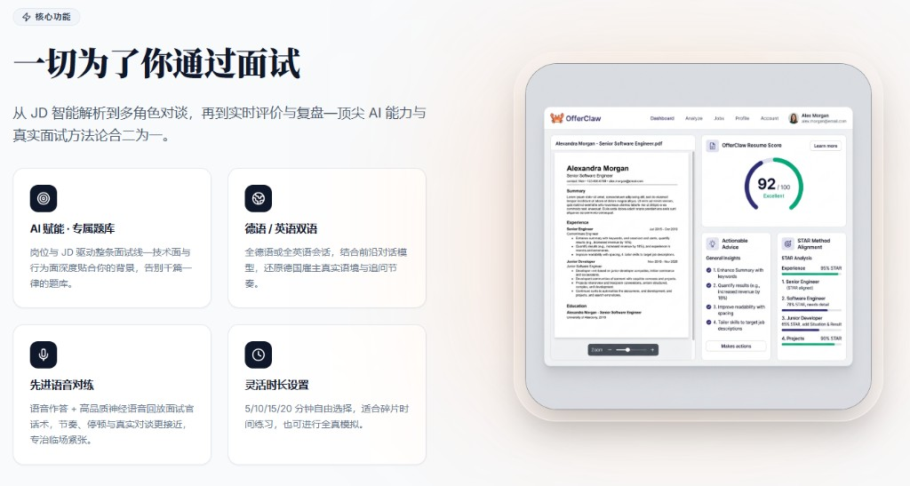
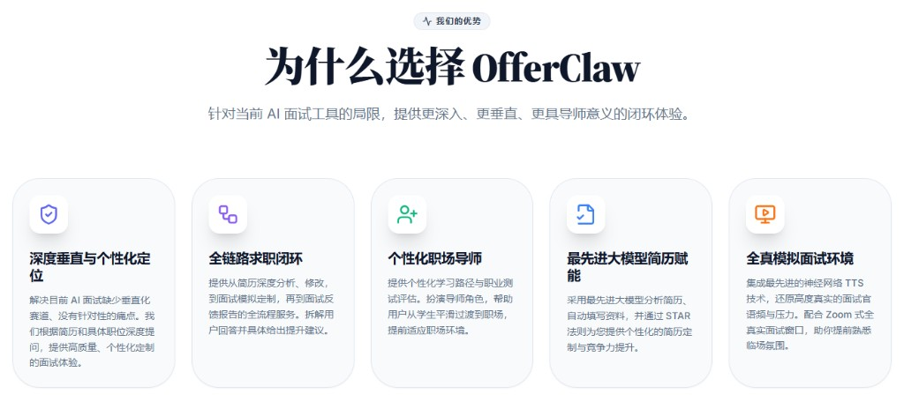
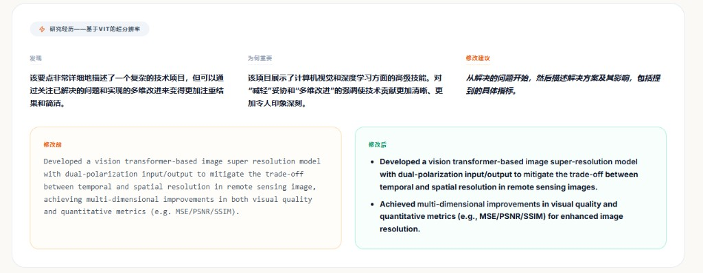
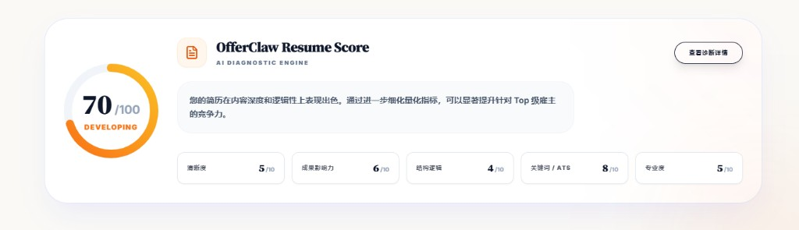
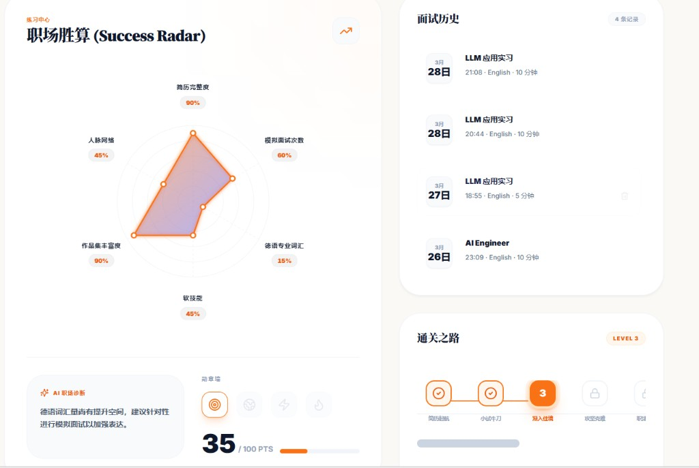
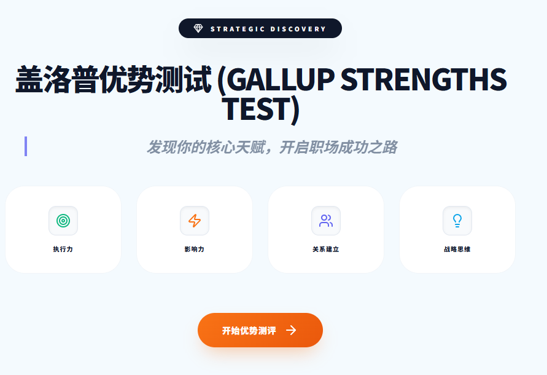

<div align="center">


<br/><br/>

# 🦀 OfferClaw

**德国面试，AI 赋能，练到满分。**

从 JD 智能解析到多角色 Agent 实时对话，从神经语音对练到结构化反馈——<br/>
一套为赴德求职者打造的全链路 AI 面试训练系统，让你在每一场 Bewerbungen 中掌控全局。

<br/>

[开始练习](#快速开始) · [核心功能](#-一切为了你通过面试) · [技术文档](technical%20documents/Frontend-Architecture.md)

</div>

<br/>

---

<br/>

## 💡 痛点

你是否也遇到过——

- 面试题千篇一律，刷了 100 道 LeetCode 结果面试官问的全是 Behavioral
- 对着镜子练口语，但没人追问，永远不知道自己的回答有多少漏洞
- 投了 Werkstudent / Praktikum，JD 写得天花乱坠，但不知道面试官真正想考什么
- 简历改了 10 版，依然收不到回复，不知道到底哪里出了问题

**OfferClaw 解决的就是这些问题。**

不是又一个通用聊天机器人套壳，而是一个**理解你的简历、读懂你的 JD、模拟真实面试官追问逻辑**的全链路训练系统。

<br/>

---

<br/>

## ⚡ 一切为了你通过面试



<br/>

<table>
<tr>
<td width="50%" valign="top">

**🎯 AI 赋能 · 专属题库**

岗位与 JD 驱动整条面试线——技术面与行为面深度贴合你的背景。多 Agent 系统自动规划面试节奏，追问像真人面试官一样犀利。

</td>
<td width="50%" valign="top">

**🌍 德语 / 英语双语**

全德语或全英语会话，结合前沿大模型，还原德国雇主真实语境与追问节奏。不是翻译题目，而是地道的 Vorstellungsgespräch。

</td>
</tr>
<tr>
<td valign="top">

**🎙️ 神经语音对练**

语音作答 + Gemini Neural TTS 实时回放面试官话术。增量流式播放，延迟低至毫秒级，节奏和停顿与真人无异，专治临场紧张。

</td>
<td valign="top">

**⏱️ 灵活时长**

5 / 10 / 15 / 20 分钟自由选择。碎片时间快速练一轮，也能全真模拟 20 分钟完整面试。实时计时 + 进度条，节奏一目了然。

</td>
</tr>
</table>

<br/>

---

<br/>

## 🏆 为什么选择 OfferClaw



<br/>

> 针对当前 AI 面试工具的局限，提供更深入、更垂直、更具导师意义的闭环体验。

| | 能力 | 描述 |
|:---:|------|------|
| 🔬 | **深度垂直与个性化定位** | 根据你的简历和岗位 JD 深度提问，不是通用题库，是只属于你的面试 |
| 🔄 | **全链路求职闭环** | 简历分析 → 修改建议 → 面试模拟 → 反馈报告 → 改进，一站到底 |
| 🎓 | **个性化职场导师** | 职业测评 + 学习路径规划，帮你从学生平滑过渡到职场 |
| 📄 | **大模型简历赋能** | STAR 法则自动拆解经历，量化成果，让 Recruiter 一眼看到你的价值 |
| 🎬 | **全真模拟面试环境** | 神经 TTS 还原面试官语音压力 + Zoom 式全真窗口，练的就是实战 |

<br/>

---

<br/>

## 📝 智能简历分析



<br/>

上传简历，AI 会**逐条** bullet point 给出诊断：

| 步骤 | 做什么 |
|:----:|--------|
| **发现** | 识别每条经历中的模糊表述、缺失量化、结构问题 |
| **为何重要** | 解释这样改如何让技术贡献更清晰，让 Recruiter 印象更深 |
| **修改建议** | 直接输出修改前 vs 修改后的对比——从解决的问题出发，落到具体指标 |

不是泛泛的"建议多量化"，而是精确到**每一个 bullet point** 的可操作改写。

<br/>

---

<br/>

## 📊 简历评分引擎



<br/>

**OfferClaw Resume Score** —— 五维度量化你的简历竞争力：

```
  清晰度        ████████░░  表达是否简洁、逻辑是否通顺
  成果影响力    ██████████  是否用数据说话、量化业务成果
  结构逻辑      ████░░░░░░  排版层次与信息优先级
  关键词 / ATS  ████████████  岗位关键词覆盖率，能否通过 ATS
  专业度        ██████░░░░  语言与格式的整体专业程度
```

配合评分，系统自动生成**优先执行清单**——先改什么、怎么改、改完能提升多少分。

<br/>

---

<br/>

## 🎮 练习中心



<br/>

你的所有训练数据，一个仪表盘掌控：

- **🕸️ 职场胜算雷达图** — 简历完整度 / 面试次数 / 人脉网络 / 作品集 / 德语词汇 / 软技能，六维一图看清短板
- **📋 面试历史** — 时间、岗位、语言、时长，每场练习都可查看 AI 生成的深度诊断报告
- **🏅 通关之路** — 游戏化等级 Level 1→7，从「闯荡起航」到「职场传奇」，每次练习积累经验值
- **🤖 AI 职场诊断** — 基于全部练习数据，智能锁定薄弱环节，给出下一步行动建议

<br/>

---

<br/>

## 💎 盖洛普优势测试



<br/>

> *"你最大的优势是什么？"* —— 这道题你真的答得上来吗？

四大领域 —— **执行力** · **影响力** · **关系建立** · **战略思维**。

通过专业测评发现你的 Top 5 天赋主题，并将结果融入面试准备策略。当面试官问到这道经典题时，你的回答将**有理有据**，而非空洞的自我表扬。

<br/>

---

<br/>

## 🚀 快速开始

```bash
git clone https://github.com/your-org/offerclaw.git
cd offerclaw/frontend

npm install

cp .env.example .env        # 填入 Supabase 与后端地址
npm run dev                  # → http://localhost:3000
```

| 环境变量 | 必填 | 说明 |
|---------|:----:|------|
| `VITE_SUPABASE_URL` | ✅ | Supabase 项目地址 |
| `VITE_SUPABASE_ANON_KEY` | ✅ | Supabase 匿名公钥 |
| `VITE_BACKEND_URL` | — | 后端 API（默认 `http://localhost:5000`） |

<br/>

---

<br/>

## 🛠️ 技术栈

| 层 | 技术 | 说明 |
|----|------|------|
| UI 框架 | **React 18** | 组件化 + Hooks 驱动 |
| 构建 | **Vite 5** | 极速 HMR + ESM 原生模块 |
| 路由 | **React Router 6** | 嵌套路由 + 路由守卫 |
| 样式 | **Tailwind CSS 3** | 原子化 CSS + 自定义设计系统 |
| 认证 | **Supabase Auth** | Google / LinkedIn OIDC |
| 国际化 | **i18next** | 中 / 英 / 德三语 |
| 动效 | **Framer Motion** | 页面过渡 + 交互微动画 |
| 语音 | **Gemini Neural TTS** | 流式 PCM + Web Audio API |
| 通信 | **SSE** | 实时流式 Token 推送 |
| 图标 | **Lucide React** | 轻量 SVG 图标库 |

> 📖 完整技术架构文档 → [`Frontend-Architecture.md`](technical%20documents/Frontend-Architecture.md)

<br/>

---

<div align="center">

<br/>

**OfferClaw** — 不只是模拟面试，是你的德国求职全链路 AI 教练。

*Viel Erfolg bei deinem Vorstellungsgespräch!* 🇩🇪

<br/>

</div>
