<div align="center">


<br/><br/>


### 把每一次练习，走成通向 Offer 的那条路。

**LandIt** 是为赴德实习与求职者打造的 AI 模拟面试平台 ——<br/>
读懂你的简历和 JD，像真人面试官一样追问，再把每一场练习变成可执行的下一步。

<br/>

[](https://aiinterviewer-491711-7b1cf.web.app)
&nbsp;
[](#-技术栈)
&nbsp;
[](#-快速开始)
&nbsp;
[](#-技术栈)

[快速开始](#-快速开始) · [核心功能](#-一切为了你通过面试) · [设计语言](#-harbor-设计语言) · [技术文档](technical%20documents/Frontend-Architecture.md)

</div>

<br/>

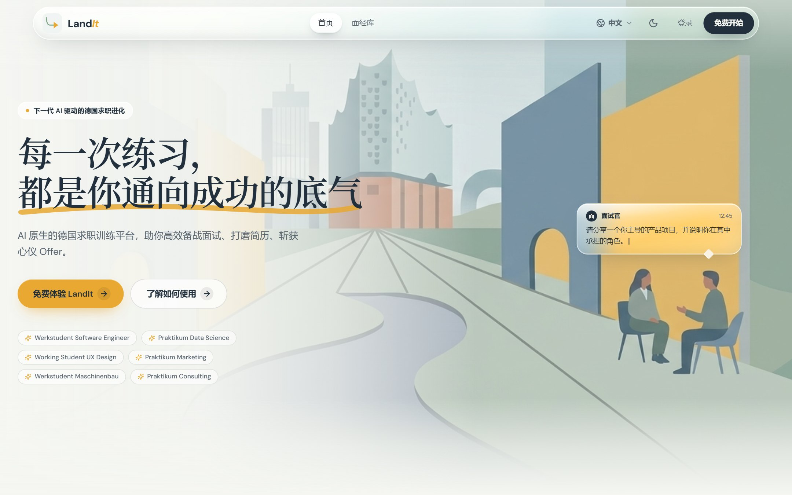

<p align="center"><sub>首页主视觉：插画里的两个人正在面试 —— 对话气泡直接「长」在他们头顶，鼠标移动时整幅画面带 WebGL 景深视差。</sub></p>

<br/>

## 🌐 在线使用

直接访问：<https://aiinterviewer-491711-7b1cf.web.app>

无需安装本地环境，使用 Google / LinkedIn 账号登录即可。生产环境使用 Firebase Hosting，
后端运行于 Google Cloud Run，用户数据和认证由 Supabase Cloud 管理。

| 服务 | 地址 |
|------|------|
| 前端 | `https://aiinterviewer-491711-7b1cf.web.app` |
| 后端 | `https://interview-backend-557559701677.europe-west1.run.app` |
| 健康检查 | `https://interview-backend-557559701677.europe-west1.run.app/api/health` |

<br/>

## 💡 为什么是 LandIt

你是否也遇到过——

- 刷了 100 道题，面试官问的全是 Behavioral；
- 对着镜子练口语，但没人追问，不知道回答有多少漏洞；
- 投了 Werkstudent / Praktikum，JD 写得天花乱坠，却不知道面试官真正想考什么；
- 简历改了 10 版，依然收不到回复。

LandIt 不是又一个聊天机器人套壳，而是一个**理解你的简历、读懂你的 JD、模拟真实面试官追问逻辑**的全链路训练系统：
简历诊断 → 定向简历 → 模拟面试 → 结构化报告 → 冲刺计划 → 复习闪卡，一条路走到 Offer。

<br/>

## ⚡ 一切为了你通过面试

<table>
<tr>
<td width="50%" valign="top">

**🎯 AI 赋能 · 专属题库**<br/>
岗位与 JD 驱动整条面试线，技术面与行为面贴合你的背景；多 Agent 规划面试节奏，追问像真人一样犀利。

</td>
<td width="50%" valign="top">

**🌍 德语 / 英语 / 中文**<br/>
全德语或全英语会话，还原德国雇主的真实语境与追问节奏 —— 地道的 Vorstellungsgespräch。

</td>
</tr>
<tr>
<td valign="top">

**🎙️ 神经语音对练**<br/>
语音作答 + Gemini Neural TTS 流式回放面试官话术，节奏和停顿接近真人，专治临场紧张。

</td>
<td valign="top">

**⏱️ 练习模式 & 正式模式**<br/>
练习模式可暂停、四级提示、私人笔记、多次作答；正式模式服务端计时，结束统一出报告。

</td>
</tr>
</table>

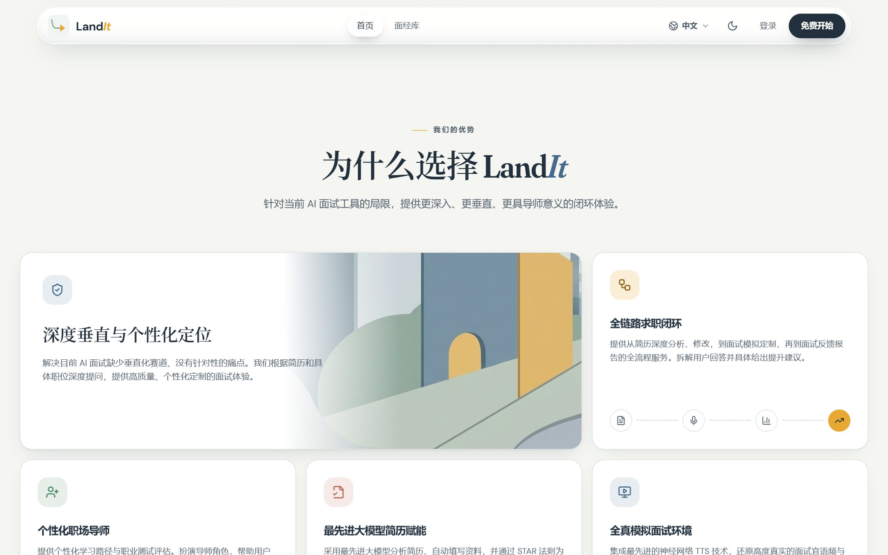

### 可恢复的练习与正式面试

- **面试官类型**：HR、Technical 或 Mixed；题型、追问、RAG 和最终报告都遵守对应边界。
- **练习模式**：暂停/恢复、四级提示、私人笔记、语音听写、题目朗读、多次作答、重试、掌握和跳过；每次尝试保留即时证据化反馈，达到时长或题数上限自动结束。
- **正式模式**：服务端截止时间持续生效，关闭页面不会暂停；中途禁止提示和重答，最终统一生成报告。
- **四种难度**：Easy、Medium、Hard 使用不同提问约束，Adaptive 依据回答质量动态调整下一题。
- **断线恢复**：每场面试使用 `/interview/:interviewId`；刷新、文本和 Gemini Live 重连都只恢复当前面试的 checkpoint。
- **安全重试**：创建面试和所有有副作用的练习动作使用幂等键，网络重试不会重复创建、扣分、出题或保存答案。

<br/>

## 🧭 一个工作台，所有路径一目了然

登录后，所有页面都收进左侧一条**液态玻璃侧栏**，按「面试训练 / 求职材料 / 社区」分组；顶栏只保留面包屑和语言、主题开关。
侧栏可折叠成图标栏，移动端变成抽屉。

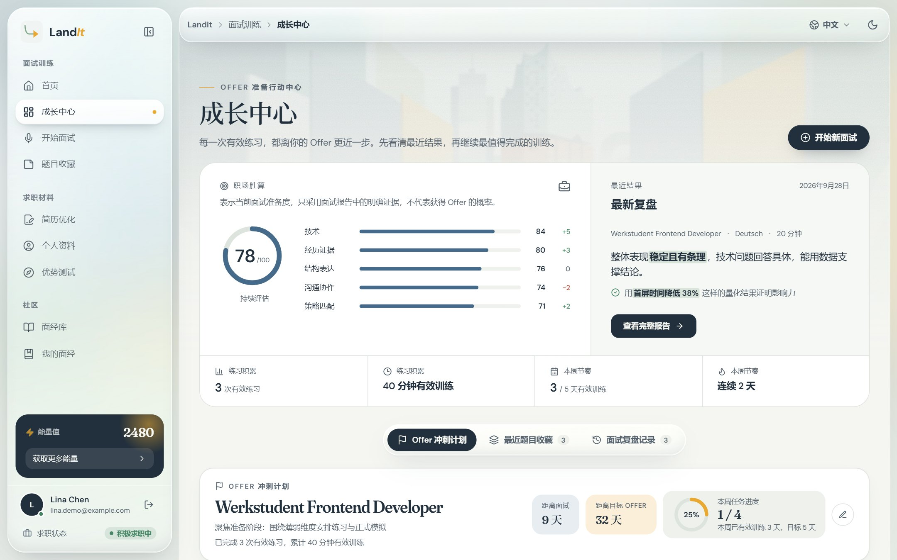

<table>
<tr>
<td width="50%" valign="top">

**🚀 Offer 冲刺计划 · 任务小卡**<br/>
设定目标岗位与日期后，每周生成 3–5 张按类型着色的任务卡：倒计时、本周进度环、今日先做、一键开始 / 完成 / 跳过。

</td>
<td width="50%" valign="top">

**🃏 复习闪卡**<br/>
最近收藏的题目以闪卡呈现，点一下在 3D 空间里翻面看回答要点；完整筛选、笔记与再次练习在「题目收藏」。

</td>
</tr>
<tr>
<td>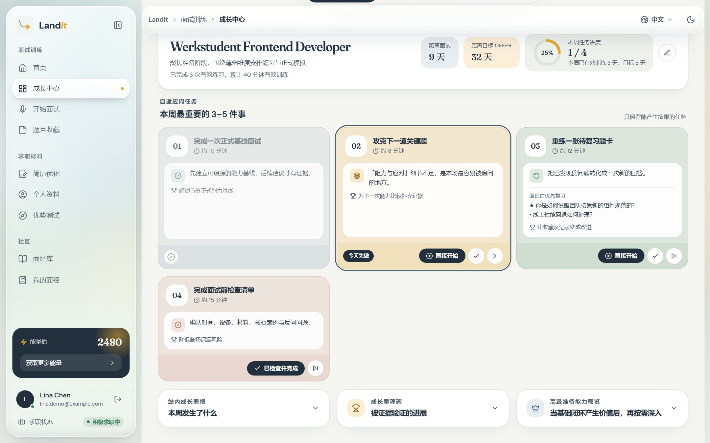</td>
<td>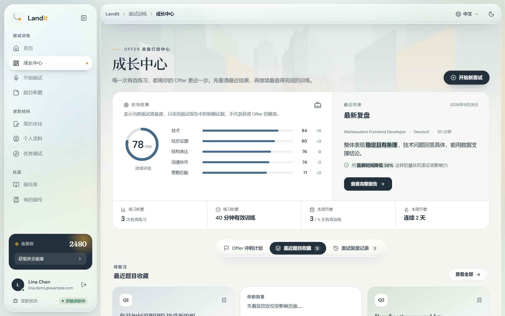</td>
</tr>
</table>

- **🎯 职场胜算** —— 根据真实面试报告，从技术、经历证据、结构表达、沟通协作、策略匹配五个维度评估，每个判断都有证据。
- **📄 最新复盘** —— 报告入口直接可见；暂停的练习可以恢复原题目、回答、提示、笔记和计时状态。
- **📚 面试复盘记录** —— 按报告和待继续状态筛选，状态一眼可读。

<br/>

## 📝 开始面试 · 简历 · 个人资料

<table>
<tr>
<td width="50%">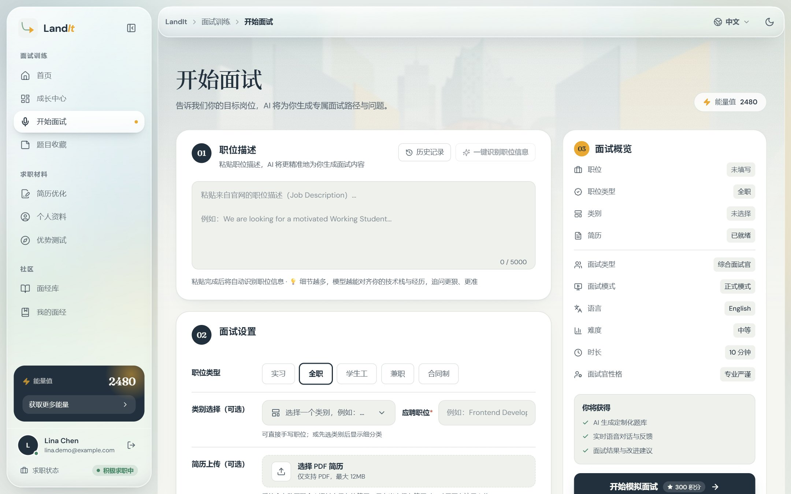</td>
<td width="50%">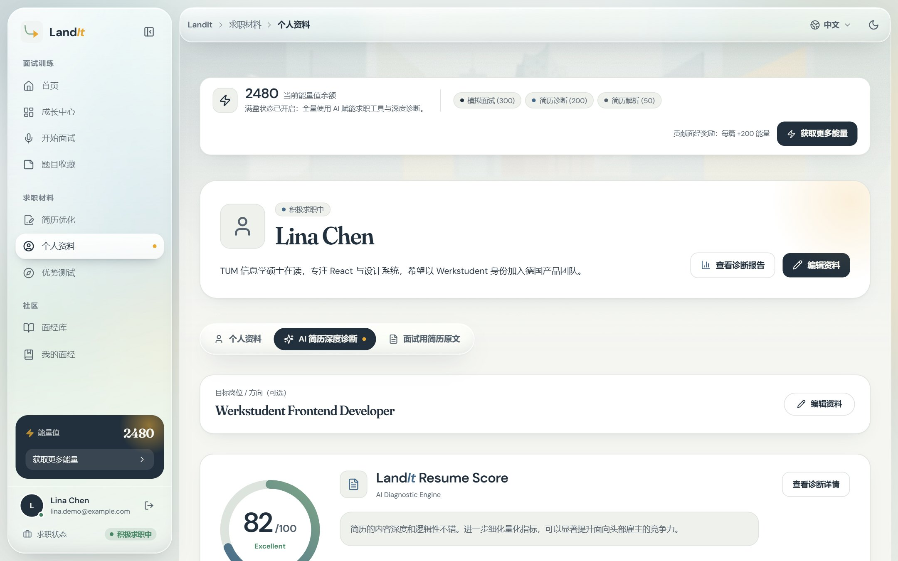</td>
</tr>
<tr>
<td valign="top">

**开始面试**：先贴 JD（自动识别岗位与类型），再配置面试官类型、模式、难度、语言、时长与性格；右侧概览实时汇总，一键开始。

</td>
<td valign="top">

**个人资料**：拆成「个人资料 / AI 简历诊断 / 简历原文」三个标签。诊断给出五维评分、逐条问题与改写前后对比，以及优先执行清单。

</td>
</tr>
</table>

- **简历优化**：读取个人资料里的简历，识别 JD 关键词，在不虚构经历的前提下生成定向简历和求职信，可导出 Word / PDF。
- **盖洛普优势测试**：执行力 · 影响力 · 关系建立 · 战略思维四大领域，找出 Top 天赋并融入面试准备。
- **面经库**：真实面经按公司、岗位、轮次整理；左侧检索与统计，右侧展开每一轮的真题。

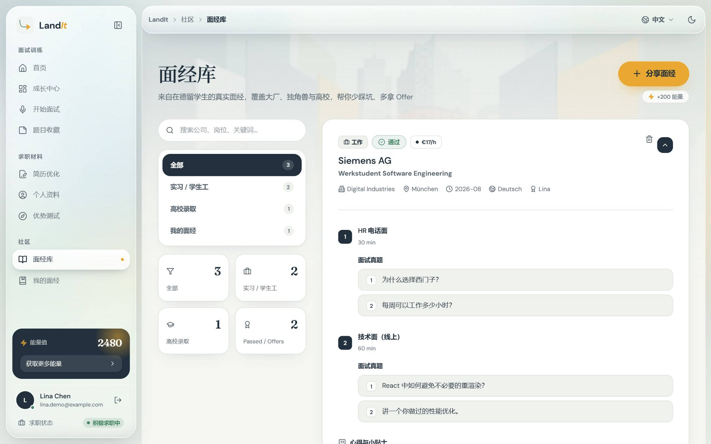

<br/>

## 🎨 Harbor 设计语言

整套界面的母题来自首页那张汉堡港插画：易北爱乐厅、一条通向远方的路、墙上的拱门，还有两个正在交谈的人。

| 色彩 | 取自 | 用途 |
|:---:|------|------|
|  **Ink** | 深港蓝 | 正文、主按钮、选中态 |
|  **Harbor** | 插画墙面 | 链接、图表、强调 |
|  **Sage** | 标志路径 | 成功、正向反馈 |
|  **Ochre** | 标志箭头 | 每屏唯一的强调按钮、高光 |
|  **Brick** | 音乐厅红砖底座 | 警示、点缀 |

- **字体**：标题用 *Fraunces* / 思源宋体做编辑感，界面用与 LandIt 字标同源的 *DM Sans*。
- **3D，但克制**：首页主视觉是 WebGL 景深视差（程序化深度图，鼠标驱动镜头轻移）；收尾区是一条由 three.js 实时渲染的拱门小路，镜头随滚动缓慢前进，尽头是一团暖光。离开视口即停渲染，并尊重「减少动态效果」。
- **液态玻璃，只用在浮层**：侧栏、顶栏、分段控件、悬浮气泡用仿 Apple Liquid Glass 的高透玻璃；内容卡片保持实色，信息层级不糊。
- **深色模式**：同一套 token 的「夜色港口」版本，所有页面自动跟随。

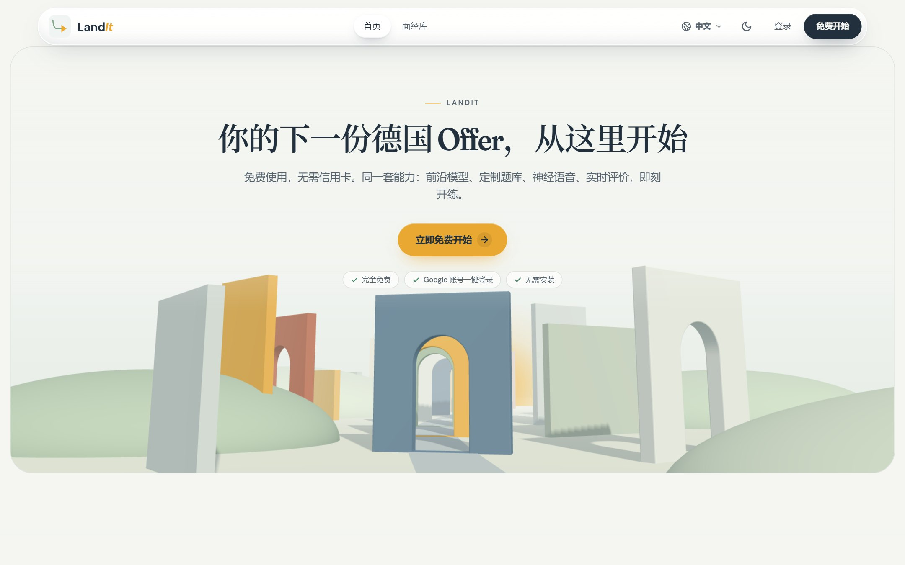

<table>
<tr>
<td width="50%">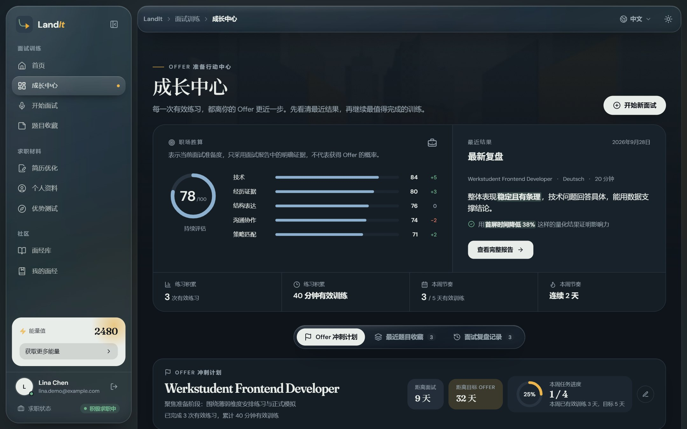</td>
<td width="50%">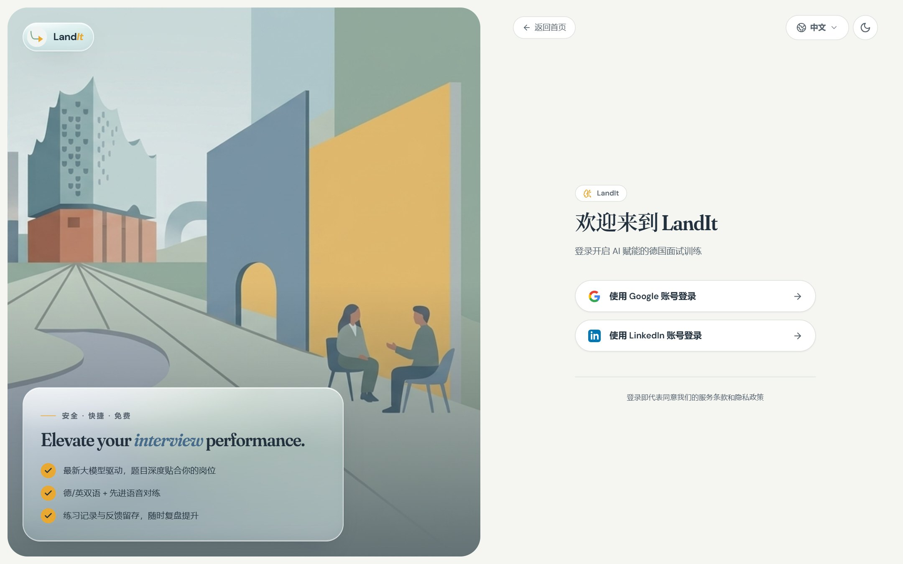</td>
</tr>
</table>

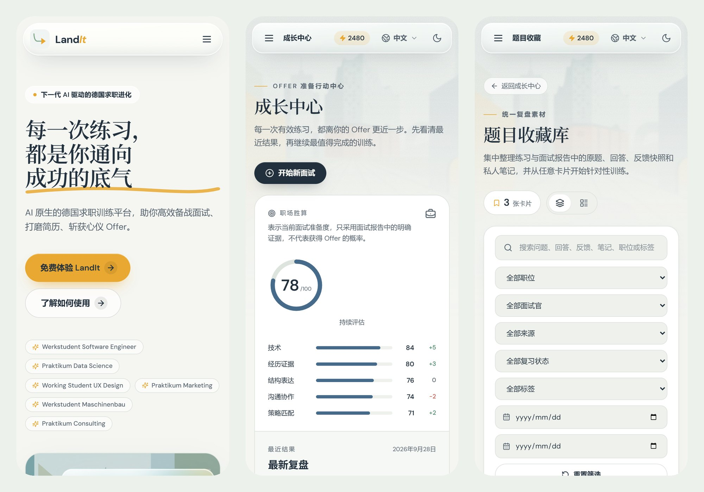

<br/>

## 🚀 快速开始

本项目是 Node.js/Vite 前端，依赖安装在当前目录的 `node_modules` 中，并由 `package-lock.json` 锁定版本。

前置要求：Node.js 20.19+ 或 22.12+（Vite 8 的最低要求）。从仓库根目录执行：

```bash
cd ai_interviewer_frontend

# 严格按照 package-lock.json 安装依赖
npm ci

# macOS / Linux
cp .env.example .env

# Windows PowerShell（与上一条二选一）
Copy-Item .env.example .env
```

编辑 `.env`，填入 Supabase 项目地址和 Anon Key，然后启动开发服务器：

```bash
npm run dev
```

开发地址为 `http://localhost:3000`。Vite 会把 `/api` 请求代理到 `http://localhost:5000`，因此请先启动后端服务。

当 `.env` 设置 `VITE_LOCAL_SUPABASE=true` 时，登录页会显示本地账户按钮并隐藏云端 OAuth 按钮。
首次点击会在本地 Supabase 自动创建开发账户，后续直接登录。

| 环境变量 | 必填 | 说明 |
|---------|:----:|------|
| `VITE_SUPABASE_URL` | ✅ | Supabase 项目地址 |
| `VITE_SUPABASE_ANON_KEY` | ✅ | Supabase 匿名公钥 |
| `VITE_API_URL` | — | 后端 API 地址；优先级高于 `VITE_BACKEND_URL`，生产环境推荐使用 |
| `VITE_BACKEND_URL` | — | 后端 API 地址；本地未设置时通过 Vite 代理访问 `localhost:5000` |

### 构建与本地预览

```bash
npm run build
npm run preview
```

生产构建产物位于 `dist/`。`preview` 仅用于部署前检查，不应作为生产 Web 服务器。

持久化面试功能的完整本地验收还需要同时启动后端和本地 Supabase。自动化状态机、并发与幂等测试位于后端仓库；
前端最低回归检查为 `npm run build`，上线前还应人工覆盖：

- 练习模式的暂停/恢复、提示、笔记、多次作答、掌握和跳过；
- 正式模式不能暂停且关闭页面后服务端计时继续；
- 两个标签页分别打开不同面试时不会串线；
- Gemini Live 断线重连只恢复当前 `interviewId` 的上下文。

### Firebase Hosting 部署

项目已包含 `firebase.json` 和 `.firebaserc`。先在 `.env.production` 中设置线上后端地址，再执行：

```bash
npm ci
npm run build
npx firebase-tools login
npx firebase-tools deploy --only hosting --project aiinterviewer-491711-7b1cf
```

Supabase Anon Key 会被编译进浏览器代码，只能使用公开的 Anon Key；绝不能在任何 `VITE_*` 变量中填写
Supabase Service Role Key 或其他服务端密钥。

<br/>

## 🛠️ 技术栈

| 层 | 技术 | 说明 |
|----|------|------|
| UI 框架 | **React 18** | 组件化 + Hooks |
| 构建 | **Vite 8** | 极速 HMR + ESM |
| 路由 | **React Router 7** | 嵌套路由 + 路由守卫 |
| 样式 | **Tailwind CSS 3** | Harbor 设计 token（`src/index.css`） |
| 3D | **WebGL · three.js** | 景深视差主视觉、拱门小路场景（按需加载） |
| 动效 | **Framer Motion** | 页面过渡、共享布局动画、3D 翻卡 |
| 认证 | **Supabase Auth** | Google / LinkedIn OIDC |
| 国际化 | **i18next** | 中 / 英 / 德三语 |
| 语音 | **Gemini Neural TTS** | 流式 PCM + Web Audio API |
| 通信 | **SSE** | 实时流式 Token 推送 |
| 持久化协议 | **Supabase + interviewId** | 服务端 checkpoint、幂等重试、乐观锁和断线恢复 |
| 图标 | **Lucide React** | 轻量 SVG 图标 |

> 📖 完整技术架构文档 → [`Frontend-Architecture.md`](technical%20documents/Frontend-Architecture.md)

<br/>

---

<div align="center">


**LandIt** — 不只是模拟面试，是你在德国求职路上的全链路 AI 教练。

*Viel Erfolg bei deinem Vorstellungsgespräch!* 🇩🇪

</div>
